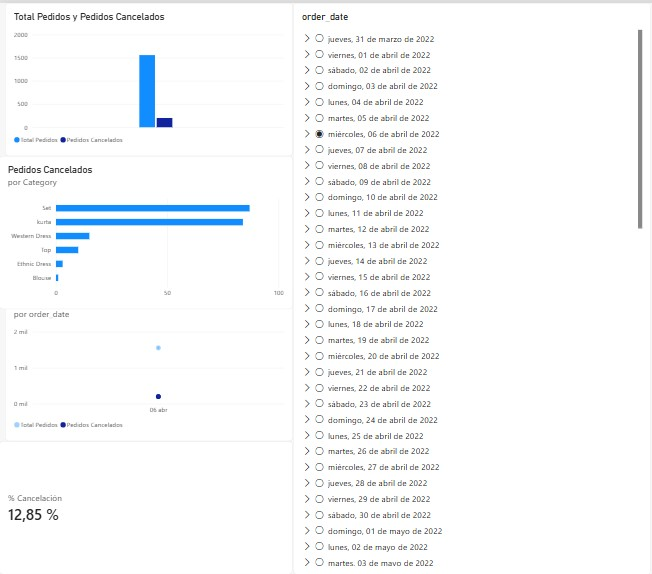

# Análisis de Ventas E-commerce: De CSV a Dashboard en Power BI

**Stack:** PostgreSQL · SQL · DAX · Power BI

## Resumen

Proyecto de práctica end-to-end: carga, limpieza y modelado de dos datasets de e-commerce en PostgreSQL, análisis exploratorio con SQL, y construcción de un dashboard interactivo en Power BI conectado en modo DirectQuery.

## Datasets utilizados

| Dataset | Filas | Dominio |
|---|---|---|
| Superstore (`train`) | 9.800 | Retail minorista en EE.UU. |
| Amazon Sale Report | 128.975 | E-commerce de indumentaria en India |

Se modelaron en bases de datos separadas al no existir una relación real entre ambos dominios de negocio, evitando forzar un esquema artificial.

## 1. Carga de datos a PostgreSQL

- Diseño de esquema (`CREATE TABLE`) mapeando cada columna del CSV a su tipo correspondiente.
- Uso de `\copy` (carga del lado del cliente) en lugar de `COPY`, para evitar restricciones de permisos del proceso de PostgreSQL sobre el sistema de archivos del usuario.
- Manejo de nombres de columna no estándar (con espacios, mayúsculas o guiones) mediante identificadores entrecomillados.

## 2. Resolución de problemas de datos reales

Durante la carga surgieron varios problemas típicos de datasets sin curar, resueltos de forma incremental:

- **Codificación de caracteres:** el archivo Superstore contenía bytes no válidos en UTF-8, propios de una exportación desde Windows. Se resolvió reprocesando el archivo en Python (`errors='replace'`) antes de la carga.
- **Formato de fecha no estándar:** el dataset de Amazon traía fechas en formato `MM-DD-YY`, incompatible con el `DateStyle` por defecto de PostgreSQL. Se cargó la columna como texto y se parseó posteriormente con `TO_DATE()`, materializando el resultado en una columna `DATE` nueva.
- **Longitud de campo subestimada:** una columna de IDs de promociones superaba ampliamente el largo esperado (texto concatenado de múltiples promociones por fila). Se resolvió tipando la columna sin límite de longitud en lugar de iterar sobre distintos valores de `VARCHAR(n)`.

## 3. Preprocesamiento de datos con Python

Antes de la carga a PostgreSQL, se utilizó Python como paso intermedio de limpieza sobre el archivo con problemas de codificación:

```python
with open(r'C:\Users\mmack\dataAn\train.csv', 'r', encoding='cp1252', errors='replace') as f_in:
    contenido = f_in.read()

with open(r'C:\Users\mmack\dataAn\train_utf8.csv', 'w', encoding='utf-8') as f_out:
    f_out.write(contenido)
```

- Lectura del archivo original con su codificación real (`cp1252`), reemplazando los bytes inválidos que no correspondían a ningún carácter de esa tabla de codificación.
- Reescritura del archivo en UTF-8, formato requerido por PostgreSQL, dejándolo listo para `\copy`.
- Uso de raw strings (`r'...'`) para manejar correctamente rutas de Windows, evitando que Python interprete las barras invertidas como secuencias de escape.

## 4. Análisis exploratorio en SQL

Ejemplos de consultas desarrolladas sobre ambos datasets:

```sql
-- Evolución de ventas por año (Superstore)
SELECT EXTRACT(YEAR FROM "Order Date"::date) AS anio, SUM("Sales") AS total
FROM train
GROUP BY anio
ORDER BY anio;

-- Tasa de cancelación de pedidos (Amazon)
SELECT ROUND(100.0 * SUM(CASE WHEN "Status" = 'Cancelled' THEN 1 ELSE 0 END) / COUNT(*), 2) AS pct_cancelado
FROM amazon_sales_report;

-- Cancelaciones por mes, usando FILTER como alternativa legible a CASE WHEN
SELECT
    DATE_TRUNC('month', order_date) AS mes,
    COUNT(*) FILTER (WHERE "Status" = 'Cancelled') AS cancelados,
    COUNT(*) AS total,
    ROUND(100.0 * COUNT(*) FILTER (WHERE "Status" = 'Cancelled') / COUNT(*), 2) AS pct
FROM amazon_sales_report
GROUP BY mes
ORDER BY mes;
```

**Hallazgo principal:** la tasa de cancelación global del dataset de Amazon es del 14,21%, con distribución relativamente pareja entre categorías de producto (13–15%), sin outliers significativos.

## 5. Modelado y visualización en Power BI




- Conexión de Power BI Desktop a PostgreSQL vía el conector nativo, en modo **DirectQuery** (consulta en vivo contra la base, sin importar los datos a memoria).
- Definición de medidas en DAX para separar la lógica de negocio de los datos crudos:

```dax
Total Pedidos = COUNTROWS('public amazon_sales_report')

Pedidos Cancelados = CALCULATE(
    COUNTROWS('public amazon_sales_report'),
    'public amazon_sales_report'[Status] = "Cancelled"
)

% Cancelación = DIVIDE([Pedidos Cancelados], [Total Pedidos], 0)
```

- Diseño de visuales separando explícitamente magnitudes de distinta escala: una tarjeta (KPI) para el porcentaje de cancelación, y un gráfico de columnas independiente para los conteos absolutos, evitando el error común de mezclar porcentajes y totales en un mismo eje.
- Incorporación de un segmentador (slicer) para permitir filtrado interactivo del dashboard completo.

## Habilidades demostradas

- SQL: DDL, `COPY`/`\copy`, funciones de agregación, `GROUP BY`, `FILTER`, funciones de fecha, `ALTER TABLE`.
- Python: manejo de encoding de archivos, lectura/escritura de archivos, manejo de rutas de Windows con raw strings.
- Limpieza de datos: codificación de caracteres, parseo de fechas, tipado de columnas.
- Modelado de datos para BI: medidas DAX, diseño de visuales, conexión DirectQuery.
- Resolución de problemas: diagnóstico y corrección iterativa de errores de carga sobre datos reales no curados.

---
*Documentación de un proyecto de práctica personal — Mauricio Mackinze*
